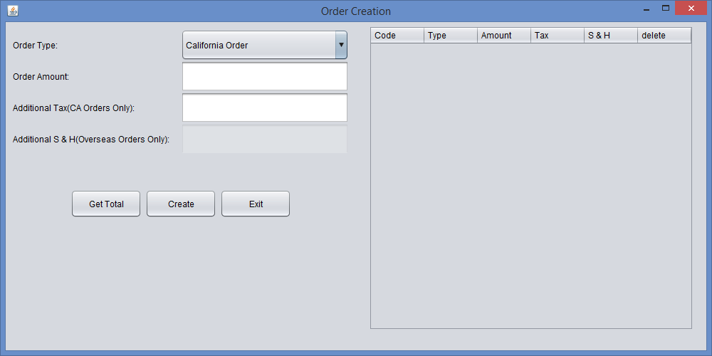
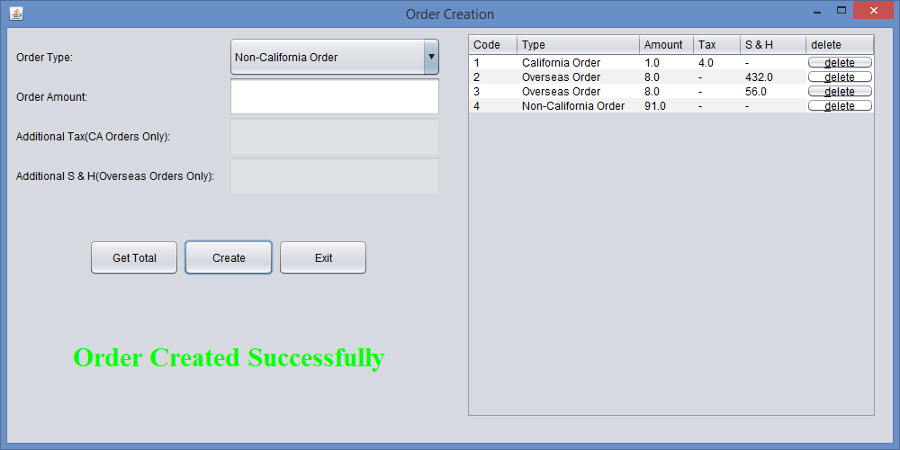
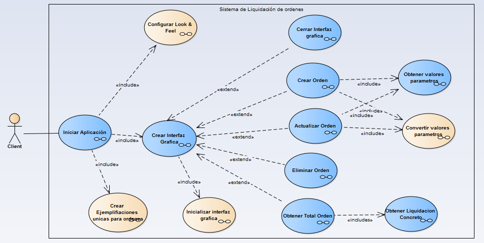
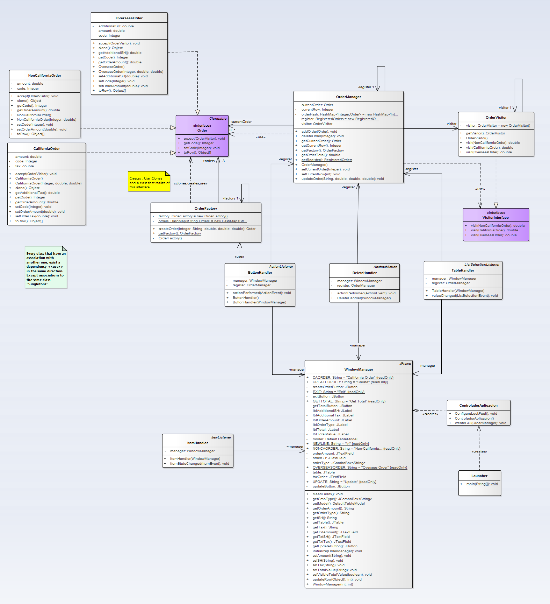

# Order Creator

>"In this project is shown a basic implementation of different design patterns  in order to create orders."

Patterns used in this project
 - Visitor
 - Singleton
 - Factory Method
 - Abstract Factory
 - Prototype

 ## Graphic Interface
 
 

 ## Models

 ### Functional Model
 

 ### Structural Model
 
